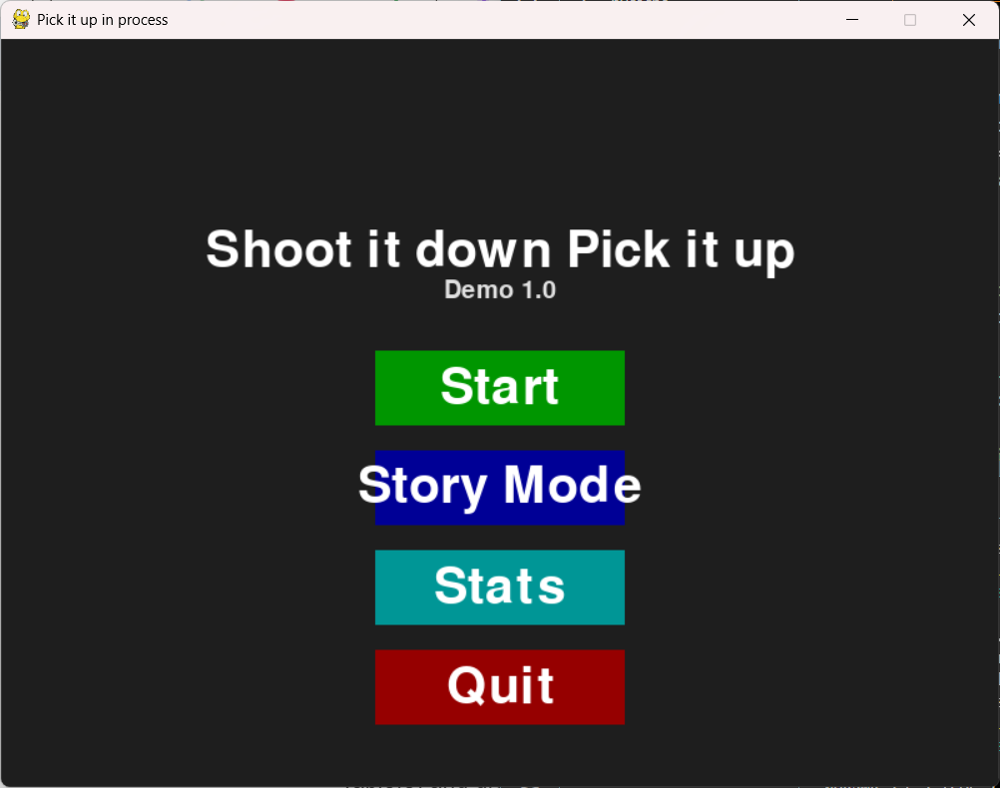
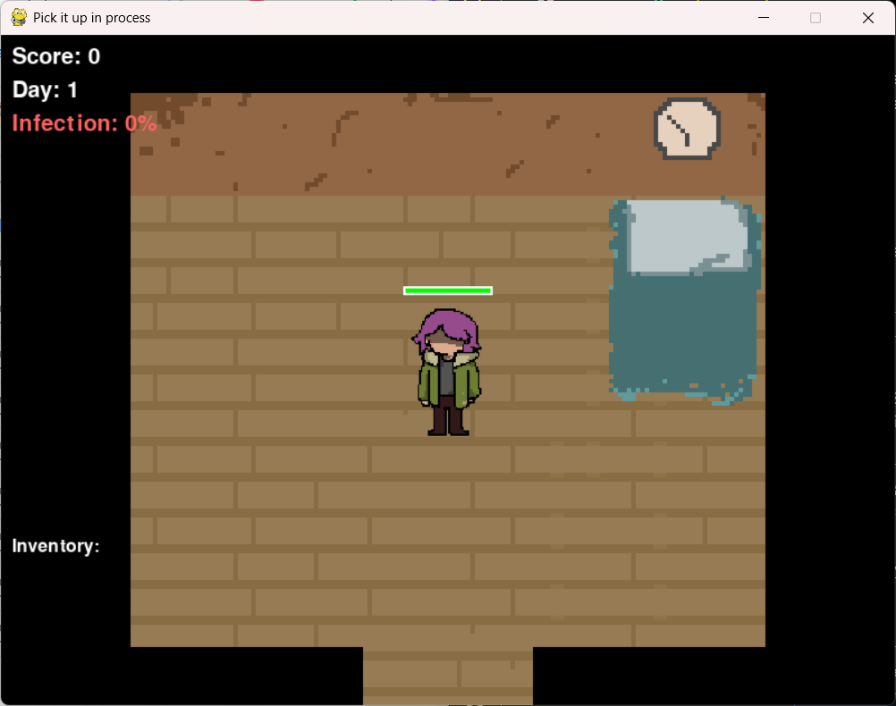
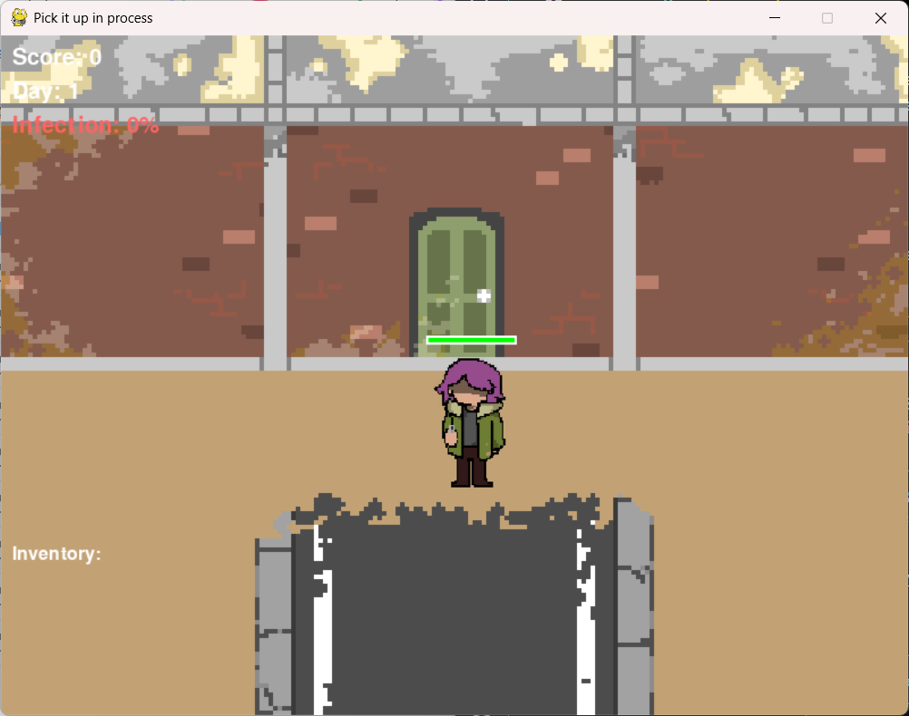
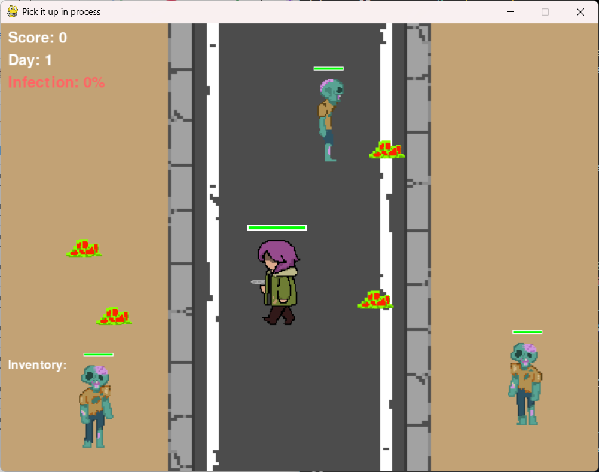
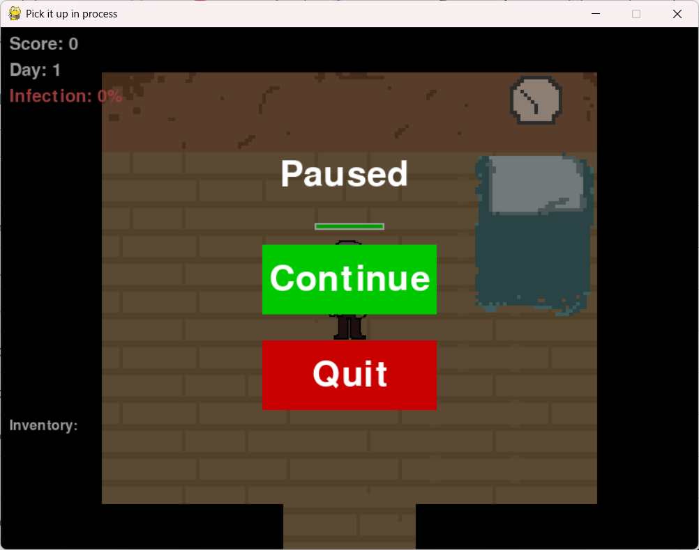
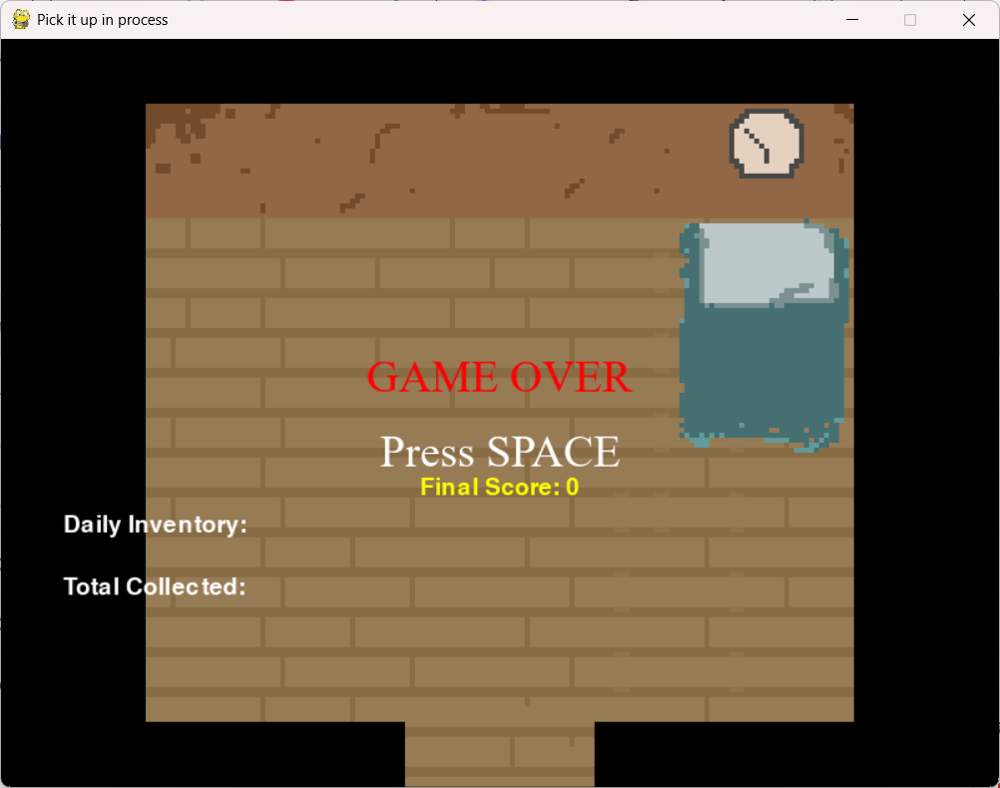

# Project Description

## 1. Project Overview
Provide a high-level understanding of the project.

- **Project Name:**  
Shoot it down Pick it up
- **Description:**  
  **Shoot it down Pick it up** is a 2D pixel shooter game where the player takes the role of a trash collector in a zombie‑infested town. The game offers two modes:
  **Normal Mode**, where players clean the town and survive as many days as possible, and **Story Mode**, where players must collect seven hidden pages 
  to uncover the town’s backstory and reach the ending. Gameplay combines shooting mechanics, resource collection, and survival strategy.

- **Problem Statement:**  
  The project addresses the challenge of combining environmental awareness (trash collection) with engaging gameplay mechanics. 
  It aims to create a fun yet meaningful experience that highlights the importance of responsibility and persistence in hostile environments.

- **Target Users:**  
  - Casual gamers
  - Students learning game development
  - Indie game players 

- **Key Features:**  
  - Animated sprites for player and zombie characters  
  - Health bars and infection rate mechanics  
  - Data logging into CSV files for statistical tracking
  
- **Screenshots:**  
   
   
   
   
   
   
  
- **Proposal:** [Original project proposal(PDF)](Original_Project_Proposal.pdf)

- **Youtube video:**  https://youtu.be/Ag4DfNvyMO0?si=SvykiM7MmQ3f_r1v
---

## 2. Concept

### 2.1 Background
- **Why this project exists**
  To create a simple yet engaging shooter game that blends survival mechanics with environmental cleanup.  
- **What inspired the project**
  This game's art style took inspiration from Undertale and Deltarune while the idea of combining zombie survival with trash collection was inspired by 
  the desire to merge action gameplay with a unique theme.  
  
- **Importance of solving this problem**
  It demonstrates how game design can integrate unconventional mechanics (like trash collection) into traditional genres, encouraging creativity in indie development.

### 2.2 Objectives

- **Objectives of the project**
  Build a functional 2D shooter game with multiple modes, animated sprites, and statistical tracking.  
- **What the system aims to achieve**
   Provide players with both entertainment and a structured challenge, while showcasing object‑oriented programming and data analysis integration.
---

## 3. UML Class Diagram
You can view the full UML Class Diagram here: [UML Diagram (PDF)](UML_diagram.pdf)

---

## 4. Object-Oriented Programming Implementation
- **GameStatus:** Manages overall gameplay statistics, including inventory totals, pages collected, zombies killed, bullets fired, and score. Handles logging data to CSV for later analysis.  
- **Player:** Represents the user-controlled character. Handles movement, collision detection, health, inventory management, shooting bullets, and collecting items.  
- **Zombie:** Represents enemy entities. Handles wandering AI, chasing the player, taking damage, dying, and updating animations.  
- **Page:** Represents collectible pages scattered across backgrounds. Tracks spawn location and whether the page has been collected.  
- **Trash:** Represents collectible trash items. Handles spawning logic, collision detection, and collection state.  
- **Bullet:** Represents projectiles fired by the player. Handles movement in the specified direction and removal when off-screen or upon collision.  
- **Background:** Manages all map backgrounds, transitions between areas, borders, and trigger zones. Provides environmental context for player and zombie interactions.  
- **Scoreboard:** Displays and tracks score, day count, pages collected, trash collected, and infection rate. Handles win/lose conditions and rendering of game-over or victory messages.  
- **Menu:** Provides the main menu and pause menu interfaces. Handles button interactions for starting the game, enabling story mode, showing stats, pausing, and quitting.  

---

## 5. Statistical Data

### 5.1 Data Recording Method
Gameplay data is collected automatically during each session through the **GameStatus** class.  
- Data points such as zombies killed, trash collected, bullets fired, score, and leftover items are tracked in real time.  
- Every 5 seconds, the system logs these values into a CSV file (`game_data.csv`).  
- Each log entry includes the elapsed time, gameplay number, and all relevant statistics.  

### 5.2 Data Features
The dataset captures both player actions and environmental outcomes
Key features: 
- **Zombies Killed:** Number of zombies eliminated by the player.  
- **Trash Collected:** Amount of contaminated trash successfully picked up.  
- **Leftover Trash & Alive Zombies:** Items or enemies not cleared within the interval, used to calculate infection rate.  
- **Bullets Fired:** Tracks player efficiency by comparing shots fired against zombies killed.  
- **Score:** Points earned from collecting trash and zombie remains, reflecting overall progress.  
- **Elimination Percentage:** Derived metric showing the efficiency of clearing trash and zombies relative to leftovers.  
- **Day Count:** Recorded by the Scoreboard to track progression across multiple in‑game days.  

These features are used to generate **bar graphs, line graphs, scatter plots, pie charts, and statistical tables**. 

---

## 6. Changed Proposed Features (Optional)

- **What was changed**
  - Additional classes added beyond the original draft: **Page, Bullet, Background, Scoreboard, Menu**.  
  - Responsibilities were redistributed:  
    - **GameStatus** now focuses on logging gameplay data to CSV and tracking totals, instead of handling menus and game over screens.  
    - **Scoreboard** manages HUD display, win/lose conditions, and infection rate.  
    - **Background** replaces the proposed “Map Configure” class, handling map transitions, zones, and borders.  
    - **Menu** provides interactive main menu, pause menu, and sleep popup functionality.  
  - A **Story Mode** was added, where collecting 7 pages triggers a win condition.  

- **Why the change was made**
  - Splitting responsibilities across specialized classes so the codebase is easier to maintain and extend.  

---

## 7. External Sources
- Code refinement and debugging suggestions provided by Microsoft Copilot.  
- Inspiration for art style from Undertale and Deltarune.  

