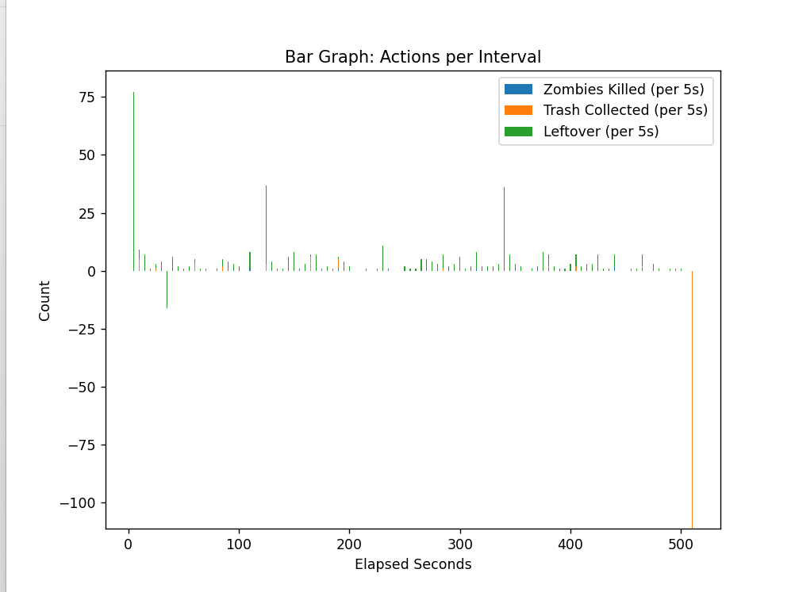
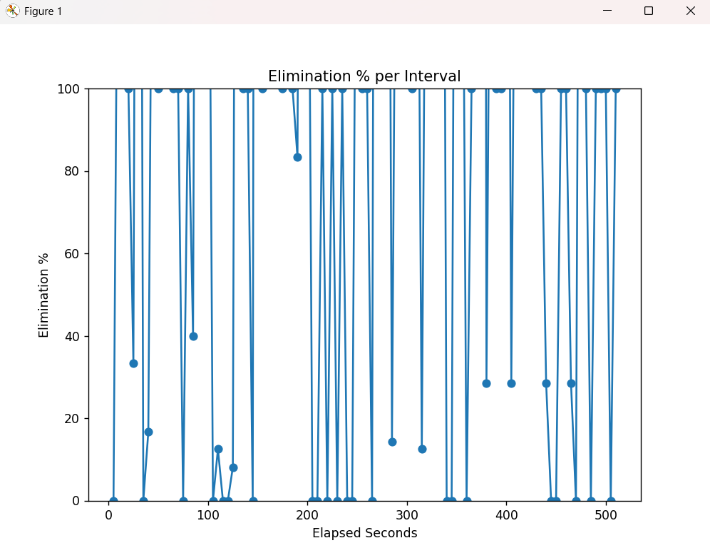
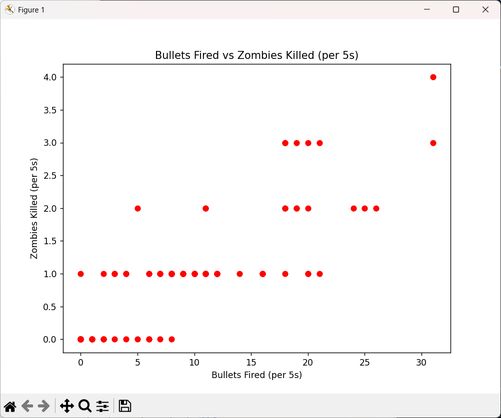
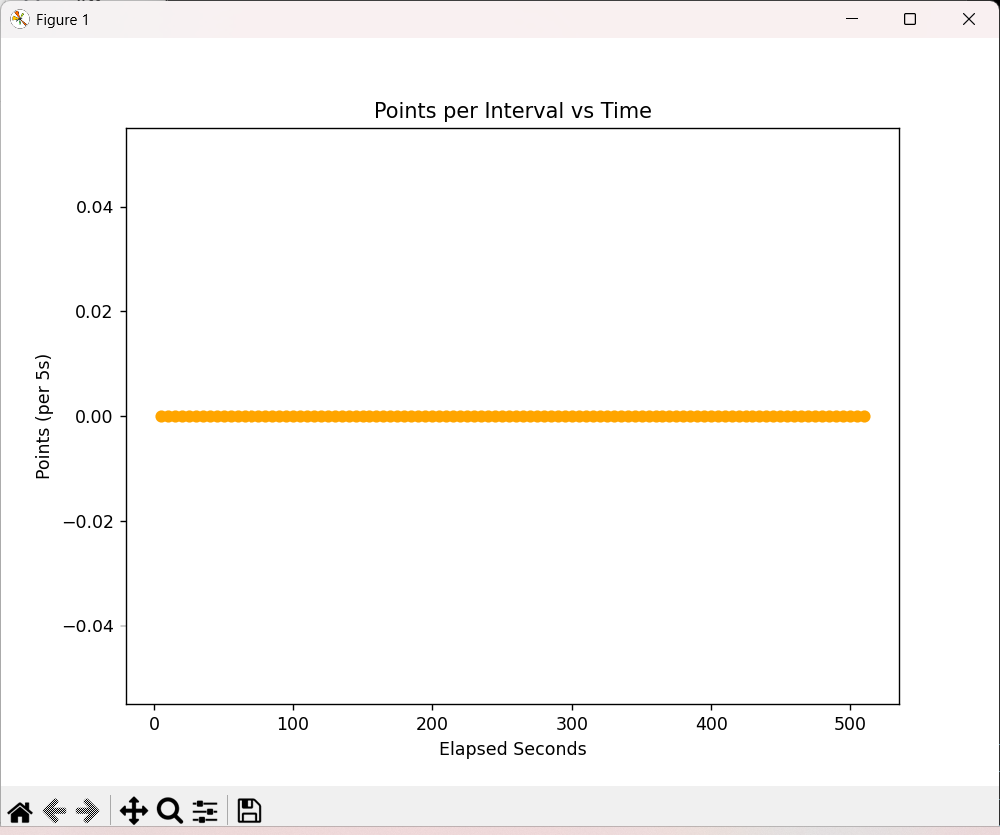
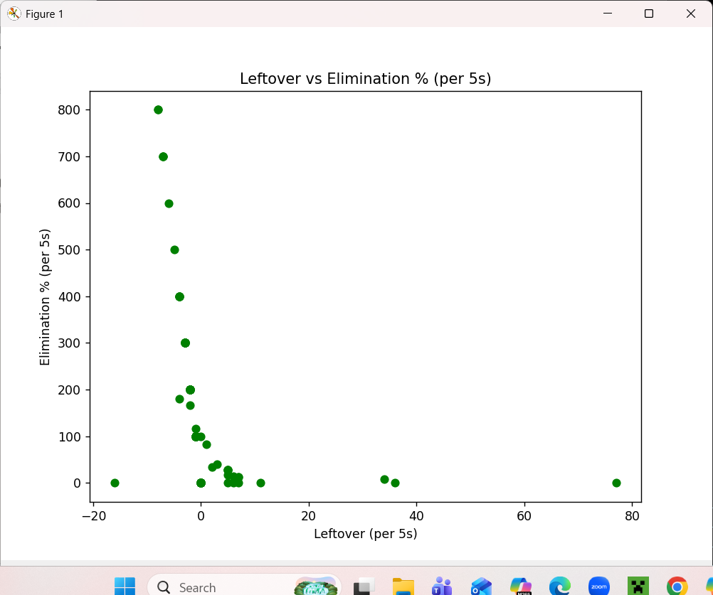
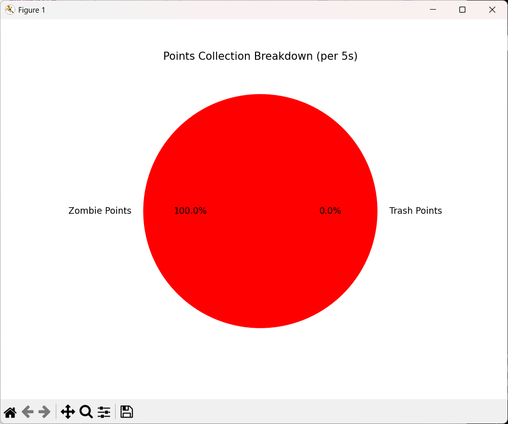
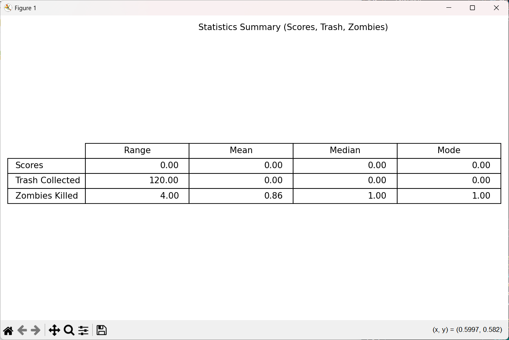

# Data Visualizations

This document provides an overview of the data visualizations from gameplay statistics.

## Graphs and Tables

### Bar Graph: Actions per Interval

This bar graph displays zombies killed, trash collected, and leftover items per time interval. It helps illustrate how player actions vary across different stages of gameplay.

### Line Graph: Elimination Percentage

This line graph shows the elimination percentage over time. It highlights how efficiently the player eliminates zombies and collects trash relative to the total number of actions.

### Scatter Plot: Bullets Fired vs Zombies Killed

This scatter plot compares bullets fired with zombies killed per interval. It provides insight into the player’s shooting accuracy and resource usage.

### Line Graph: Points vs Time

This line graph shows how points accumulate over time. It reflects the player’s progress and scoring trends during gameplay.

### Scatter Plot: Leftover vs Elimination Percentage

This scatter plot compares leftover items with elimination percentage. It helps identify whether higher elimination efficiency correlates with fewer leftover zombies or trash.

### Pie Chart: Points Breakdown

This pie chart shows the proportion of points earned from zombies versus trash. It provides a clear breakdown of where the player’s score originates.

### Statistics Table

This table summarizes key statistics (range, mean, median, mode) for scores, trash collected, and zombies killed. It offers a concise overview of the dataset’s distribution and central tendencies.
